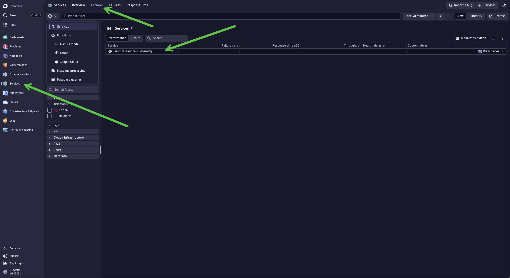

# 🔍 Lab 2: Exploring AI Traces in Dynatrace

**Duration:** ~30 minutes

In this lab, you'll explore the traces generated by your AI application in Dynatrace, understanding the insights available for LLM and RAG observability.

---

## 🎯 Learning Objectives

- Navigate to distributed traces in Dynatrace
- Analyze LLM call details including prompts and completions
- Understand token usage and cost attribution
- Explore RAG pipeline spans (embeddings, vector search, completion)
- Create basic queries for AI observability

---

<div class="why-dynatrace" markdown="1">

## 🏆 Why Dynatrace for AI Observability?

| Capability | Basic Tracing | Dynatrace |
|------------|---------------|------------|
| Collect traces | ✅ OpenTelemetry | ✅ Native OTLP + OpenLLMetry |
| See token counts | ✅ In span attributes | ✅ Unified with cost analysis |
| Correlate to infra | ❌ Manual | ✅ Davis AI auto-correlation |
| Root cause analysis | ❌ You investigate | ✅ Davis AI automatic RCA |
| Anomaly detection | ❌ Static thresholds | ✅ AI-powered baselines |
| Take action | ❌ External tools | ✅ Built-in Workflows |

</div>

---

## Step 1: Access Dynatrace

### 1.1 Open Dynatrace

Open the Dynatrace environment URL provided by your instructor:

```
https://YOUR_ENV.live.dynatrace.com
```

### 1.2 Login

Use the credentials provided by your instructor.

---

## Step 2: Find Your Service

### 2.1 Navigate to Services

1. In the left navigation menu, click **Services** (or use the search bar)
2. Click the **Explorer** tab on the top and look for your service: `ai-chat-service-{YOUR_ATTENDEE_ID}`

   For example: `ai-chat-service-{YOUR_ATTENDEE_ID}`

   

### 2.2 Open Service Details

Click on your service to select the **Additional Telemetry** page. You'll see:

- Request rate
- Request duration
- Tokens used
- Embeddings vector size

---

## Step 3: Explore Distributed Traces

### 3.1 Navigate to Traces

1. From your service page, click on **View traces** in the left panel
2. Or navigate via: **Distributed traces**

### 3.2 Filter for Your Service

Use the filter to show only traces from your service:

1. Click **Spans** on the left
4. Choose `ai-chat-service-{YOUR_ATTENDEE_ID}`

### 3.3 Select a Trace

Click on any trace to view the details. You should see traces for your `/chat` endpoint.

---

## Step 4: Analyze an AI Trace

### 4.1 Understanding the Trace Structure

A typical RAG request trace includes these spans:

```
📍 rag_chat_pipeline.workflow (Main RAG pipeline)
  └── 📍 analyze_query_intent.task (Classify user query type)
      └── 📍 AzureChatOpenAI.chat (LLM call for classification)
  └── 📍 retrieve_documents.task (Document retrieval)
      └── 📍 openai.embeddings (Generate query embedding)
      └── 📍 chroma.query (Vector store search)
  └── 📍 generate_context.task (Format retrieved docs)
  └── 📍 generate_response.task (Generate final answer)
      └── 📍 AzureChatOpenAI.chat (LLM completion call)
```

<div class="persona-box developer" markdown="1">

### 💻 Developer Focus

As a developer, focus on **debugging your RAG pipeline**:
- Is the right context being retrieved? Check `chroma.query` results
- What prompt is being sent? Inspect `gen_ai.prompt.0.content`
- Why did the model give that response? Look at `gen_ai.completion.0.content`

</div>

<div class="persona-box sre" markdown="1">

### 🔧 SRE/Platform Focus

As an SRE, focus on **cost and performance**:
- How many tokens are being used? Track `gen_ai.usage.*` attributes
- What's the latency breakdown? Compare span durations
- Are we hitting rate limits? Look for error spans

</div>

### 4.2 Examine the LLM Span

Click on the `azure_openai.chat` span under the `analyze_query_intent.task` to see:

| Attribute | Description |
|-----------|-------------|
| `gen_ai.system` | The LLM provider (Azure) |
| `gen_ai.request.model` | The model requested (gpt-4o-2024-11-20) |
| `gen_ai.response.model` | The model that responded |
| `gen_ai.request.temperature` | Temperature setting (e.g., 0.7) |
| `gen_ai.usage.input_tokens` | Number of input tokens |
| `gen_ai.usage.output_tokens` | Number of output tokens |
| `gen_ai.usage.cache_read_input_tokens` | Cached input tokens (prompt caching) |

### 4.3 View Prompts and Responses

> **Note:** Depending on configuration, you may see:
> - `gen_ai.prompt.0.content` - The input prompt content
> - `gen_ai.prompt.0.role` - The prompt role (user, system)
> - `gen_ai.completion.0.content` - The generated response content
> - `gen_ai.completion.0.role` - The completion role (assistant)
> - `gen_ai.completion.0.finish_reason` - Why generation stopped (stop, length)

This visibility is crucial for debugging AI applications!

---

## Step 5: Analyze Embedding Spans

### 5.1 Find the Embedding Span

In the trace view, locate the `openai.embeddings` span.

### 5.2 Examine Embedding Details

Key attributes include:

| Attribute | Description |
|-----------|-------------|
| `gen_ai.request.model` | Embedding model (text-embedding-3-large) |
| `gen_ai.usage.input_tokens` | Tokens in the text being embedded |
| `gen_ai.system` | The provider (Azure) |

---

## Step 6: Vector Store Spans

### 6.1 Find the Vector Store Span

Look for `chroma.query` or similar vector database spans.

### 6.2 Key Insights

Click on the `chroma.query` span to see database attributes:

| Attribute | Description |
|-----------|-------------|
| `db.system` | The vector database (chroma) |
| `db.operation` | The operation performed (query) |
| `db.chroma.query.n_results` | Number of documents retrieved (e.g., 3) |
| `db.chroma.query.embeddings_count` | Number of embeddings in the query (e.g., 1) |

---

## Step 7: Using Notebooks for AI Analysis

Dynatrace Notebooks provide powerful querying capabilities for AI observability.

### 7.1 Create a New Notebook

1. Navigate to **Notebooks** in the left-hand menu
2. Click **+ Notebook** on the top to create a new notebook
3. Name it: `AI Observability - {YOUR_ATTENDEE_ID}`

### 7.2 Query: Token Usage Over Time

Add a new section and enter this DQL query:

```sql
fetch spans
| filter service.name == "ai-chat-service-{YOUR_ATTENDEE_ID}"
| filter isNotNull(gen_ai.usage.input_tokens)
| makeTimeseries total_input_tokens = sum(gen_ai.usage.input_tokens),
    total_output_tokens = sum(gen_ai.usage.output_tokens),
    request_count = count()
```

### 7.3 Query: Model Usage Distribution

```sql
fetch spans
| filter service.name == "ai-chat-service-{YOUR_ATTENDEE_ID}"
| filter isNotNull(gen_ai.request.model)
| summarize request_count = count(), by: {gen_ai.request.model}
| sort request_count desc
```

### 7.4 Query: Average Response Time by Operation

```sql
fetch spans
| filter service.name == "ai-chat-service-{YOUR_ATTENDEE_ID}"
| summarize 
    avg_duration = avg(duration),
  by: {span.name}
| sort avg_duration desc
```

---

<div class="token-economics" markdown="1">

## Step 8: Token Economics Analysis

### Understanding Token Costs

Tokens directly translate to cost. Here's the current Azure OpenAI pricing:

| Model | Input Cost (per 1M tokens) | Output Cost (per 1M tokens) |
|-------|---------------------------|-----------------------------|
| GPT-4o | $2.50 | $10.00 |
| GPT-4o-mini | $0.15 | $0.60 |
| text-embedding-3-large | $0.13 | N/A |

</div>

### 8.1 Find Your Biggest Token Spenders

```sql
fetch spans
| filter service.name == "ai-chat-service-{YOUR_ATTENDEE_ID}"
| filter isNotNull(gen_ai.usage.input_tokens)
| summarize 
    total_input = sum(gen_ai.usage.input_tokens),
    total_output = sum(gen_ai.usage.output_tokens),
    avg_input = avg(gen_ai.usage.input_tokens),
    request_count = count(),
  by: {span.name}
| fieldsAdd total_tokens = total_input + total_output
| fieldsAdd estimated_cost_usd = (total_input * 2.50 + total_output * 10.00) / 1000000
| sort estimated_cost_usd desc
```

<div class="persona-box developer" markdown="1">

### 💻 Developer Action

**High avg_input tokens?** Your system prompt or context might be too large. Consider:
- Summarizing retrieved documents before adding to context
- Using a smaller embedding model for initial retrieval
- Implementing semantic chunking to reduce noise

</div>

### 8.2 Prompt Caching Effectiveness

Azure OpenAI caches prompts > 1024 tokens. Check your cache hit rate:

```sql
fetch spans
| filter service.name == "ai-chat-service-{YOUR_ATTENDEE_ID}"
| filter isNotNull(gen_ai.usage.cache_read_input_tokens)
| summarize 
    cached_tokens = sum(gen_ai.usage.cache_read_input_tokens),
    total_tokens = sum(gen_ai.usage.input_tokens)
| fieldsAdd cache_rate_percent = (toDouble(cached_tokens) / toDouble(total_tokens)) * 100
```

<div class="persona-box sre" markdown="1">

### 🔧 SRE Action

**Low cache rate (<30%)?** You're paying more than necessary!
- Standardize system prompts across requests
- Use longer static prefixes (1024+ tokens)
- Consider prompt templates that maximize shared content

</div>

### 8.3 Token Trend Analysis

Track token usage over time to catch runaway costs early:

```sql
fetch spans
| filter service.name == "ai-chat-service-{YOUR_ATTENDEE_ID}"
| filter isNotNull(gen_ai.usage.input_tokens)
| makeTimeseries 
    total_input = sum(gen_ai.usage.input_tokens),
    total_output = sum(gen_ai.usage.output_tokens),
    request_count = count()
```

### 8.4 What To Do With Token Data

| Finding | Indicates | Action |
|---------|-----------|--------|
| High input tokens | Large prompts/context | Reduce system prompt, compress context |
| High output tokens | Verbose responses | Add length constraints to prompts |
| Low cache rate | Inconsistent prompts | Standardize prompt templates |
| Token spikes | Potential abuse/bugs | Set up alerts, investigate queries |
| Output > Input | Complex questions | Normal for detailed answers |

---

## ✅ Checkpoint

Before proceeding to Lab 3, verify you can:

- [ ] Find your service in Dynatrace
- [ ] View distributed traces for your AI requests
- [ ] Identify LLM spans and their attributes
- [ ] See token usage metrics and understand cost implications
- [ ] Calculate token costs using DQL queries
- [ ] Create basic DQL queries for AI observability
- [ ] Understand the trace structure (HTTP → Embedding → Vector → LLM)

---

## 🆘 Troubleshooting

### "No traces found"

1. Verify your service name matches your `ATTENDEE_ID`
2. Wait 1-2 minutes for traces to appear
3. Check that your application is running and receiving requests
4. Verify the DT_ENDPOINT and DT_API_TOKEN are correct

### "Missing LLM attributes"

1. Ensure you're using the traceloop-sdk
2. Some attributes may require specific Traceloop configuration
3. Check the span details for any available attributes

### "Service not appearing"

1. Send a few more requests to your application
2. Refresh the Dynatrace UI
3. Use search (Cmd/Ctrl + K) to find your service

---

## 🎉 Great Progress!

You've explored AI traces in Dynatrace and understand how to analyze LLM observability data. Now let's learn how to use Dynatrace MCP for agentic AI interactions!

<div class="lab-nav">
  <a href="lab1-instrumentation">← Lab 1: Instrumentation</a>
  <a href="lab3-dynatrace-mcp">Lab 3: Dynatrace MCP →</a>
</div>
